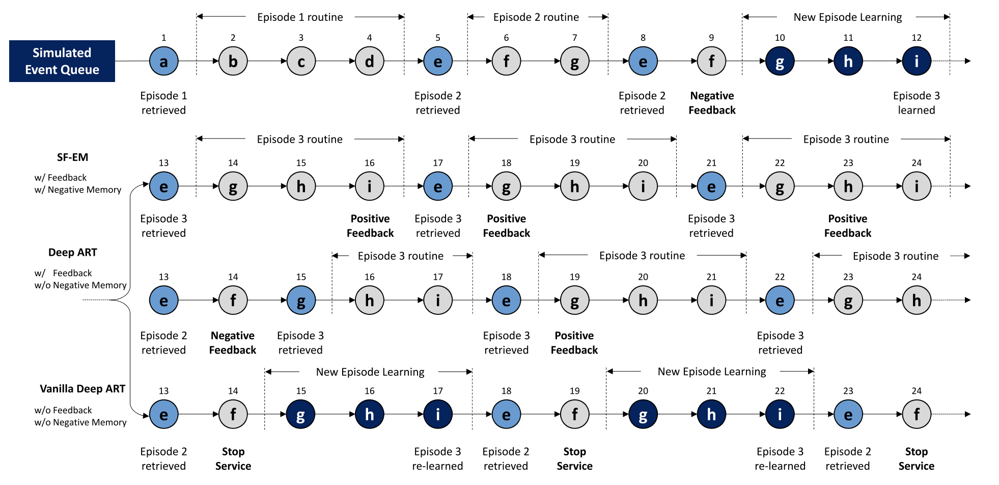
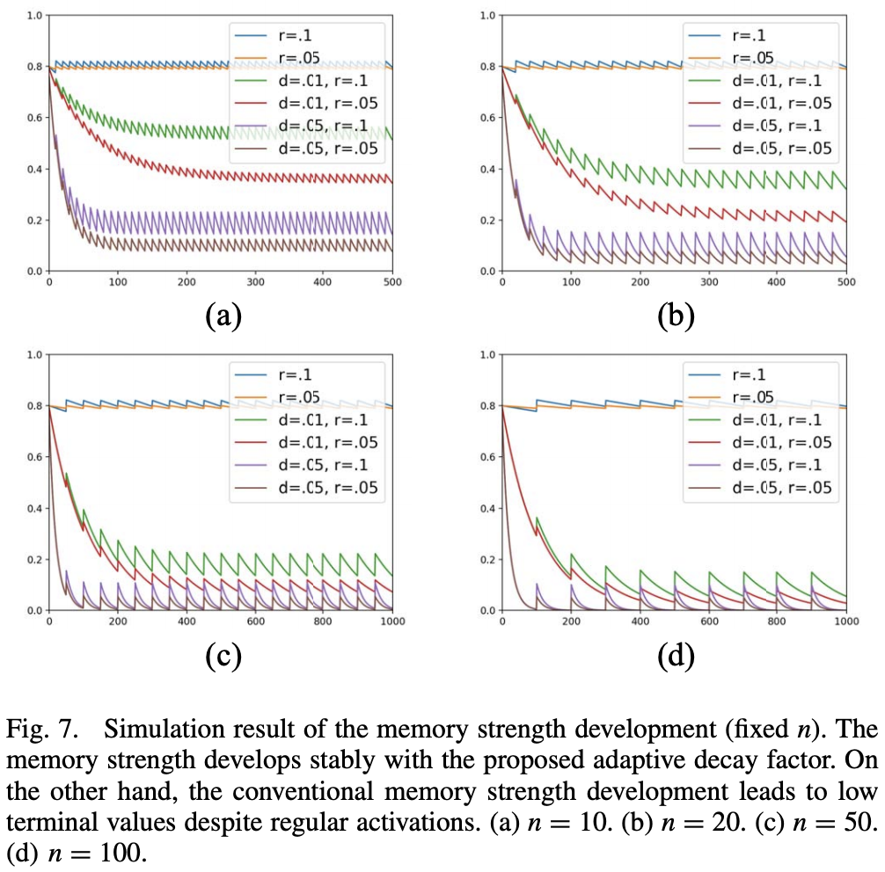

# SF-EM
The proposed SF-EM stably performs over a long period of time and accepts user feedback.
The following are the key features of SF-EM:

- An adaptive decay factor to enhance the stability of the learning process of the memory architecture.
- A feedback mechanism to reflect user feedback.
- A home service provision framework for robot and IoT collaboration.

## Requirements

* Python >= 3.6.5

## Experiment
For the performance of feedback, run the following:
```bash
python3 SFEM.py 
```
Then, you will get the following memory modulation result.


For the stabilized memory strength with the proposed adaptive decay factor, you might need to modify a part of codes in SFEM.py.
Then, you will get the following result:
 

You can also run the followings to check the performance of previous memory models. 
```bash
python3 EMART.py
python3 FeedbackART.py
python3 FusionART.py 
```


## Citation

Please consider citing this project in your publications if you find this helpful.
The following is the BibTeX.

```
@article{kim2018a,
  title={A Stabilized Feedback Episodic Memory (SF-EM) and Home Service Provision Framework for Robot and IoT Collaboration},
  author={Uehwan Kim and Jong-Hwan Kim},
  journal={IEEE Transactions on Cybernetics, Early Access},
  year={2018}
}
```

## Acknowledgments
This work was supported by Institute for Information & communications Technology Promotion(IITP) grant funded by the Korea government(MSIT)
(No.2016-0-00563, Research on Adaptive Machine Learning Technology Development for Intelligent Autonomous Digital Companion)