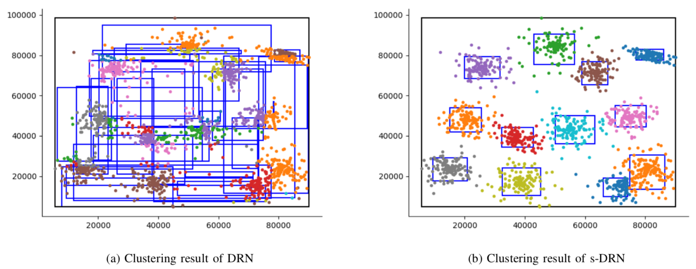
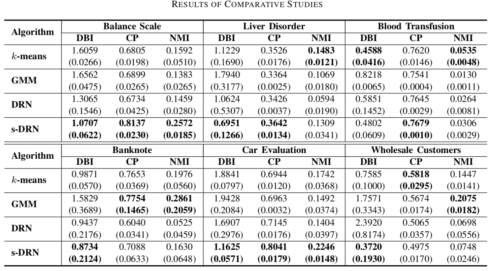

# s-DRN
We propose s-DRN which can cluster sequential data with the following featuers:

- Online incremental: s-DRN processes input data and generates clusters dynamically.
- Computationally efficient: s-DRN requires O(n) computation.
- Robust to hyper-parameter setting: the performance of s-DRN is hardly affected by the internal hyper-parameters such as vigilance parameters.

## Requirements

* Python >= 3.6.5
* numpy
* scipy
* sklearn

## Experiment and Results
For the demonstration of the performance of s-DRN, simply run the following:
```bash
python3 visualization.py
```
This will generate the comparison result between DRN and s-DRN as follows.


For comparative study and reproduce the results reported in the paper, run the following:
```bash
python3 experiment_knn_gmm.py
python3 experiment_drn_sdrn.py
```
Then, you will get the quantitative comparison results reported in the paper.

## Citation

Please consider citing this project in your publications if you find this helpful.
The following is the BibTeX.

```
@article{yoon2019stabilized,
  title={Stabilized Developmental Resonance Network},
  author={Inug Yoon*, Uehwan Kim* and Jong-Hwan Kim},
  journal={IEEE Transactions on Neural Networks and Learning Systems, Under Review},
  year={2019}
}
```

## Acknowledgments
This work was supported by Institute for Information & communications Technology Promotion(IITP) grant funded by the Korea government(MSIT)
(No.2016-0-00563, Research on Adaptive Machine Learning Technology Development for Intelligent Autonomous Digital Companion)